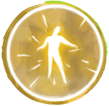
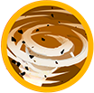

# Avalonian Archmage (dancing queen)

| Stage | Health  | Mechanics                                                                                    |
| ----- | ------- | -------------------------------------------------------------------------------------------- |
| 1     | 100–60% | Radial Limiter with one Disruptive Energy hazard; Burst followed by one rotating orb pattern |
| 2     | 60–40%  | Two Disruptive Energy hazards on subsequent Radial Limiter casts                             |
| 3     | 40–30%  | Burst is followed by two overlapping orb patterns rotating in opposite directions            |
| 4     | 30–20%  | Skybeam’s base cooldown decreases from 4 seconds to 1.5 seconds                              |
| 5     | 20–0%   | Three Disruptive Energy hazards on subsequent Radial Limiter casts                           |
{: .nowrap-1 .nowrap-2 }

The Archmage repeatedly alternates between **Radial Limiter**, lasting about **65 seconds**, and a **Burst** transition into the rotating-orb phase. The orb pattern lasts **25 seconds**, within a roughly **32-second phase**. These cycles continue through the health stages; crossing a health threshold does not immediately restart the cycle. Skybeam continues in both phases, while Disintegrate and the short sweeping beams occur during Radial Limiter.

## Archmage’s abilities

- Radial Limiter
- Disruptive Energy
- Skybeam
- Disintegrate
- Avalonian Radiance
- Energy Emission
- Burst

### Radial Limiter

After a **3-second cast**, a damaging ring forms around the Archmage. Its outer radius remains about **30 metres**, while its inner edge contracts from about **29 metres to 8 metres over 60 seconds**. The ring lasts about **65 seconds** and deals damage every **0.5 seconds** to players inside it.

### Disruptive Energy

Radial Limiter also creates moving energy hazards, each about **3 metres in radius**, following winding paths around the arena. They appear after roughly **1.5 seconds of warning** and last for the limiter phase. Contact deals physical damage and knocks the player approximately **8 metres** away.

The first Radial Limiter creates **one hazard**. After the Archmage reaches **60% health**, subsequent limiter casts create **two**; after **20%**, they create **three**.

### Skybeam

The Archmage marks a player’s position with a **2.5-metre-radius circle**. The beam lands after approximately **1.6 seconds**, deals damage and slows affected players by **20% for 2 seconds**. The damage increases when the attack hits multiple targets.

At **30% health**, its base cooldown decreases from **4 seconds to 1.5 seconds**. Other casts can still delay the next Skybeam.

### Disintegrate

A beam channels into the Archmage’s current target, dealing **seven damage pulses, 0.5 seconds apart**—about **3 seconds from the first pulse to the last**. Each pulse also affects players within about **2 metres** of the target. This attack occurs during Radial Limiter.

### Avalonian Radiance

This damage effect is shared by the Archmage’s sweeping beams and rotating orbs. Hits can deal repeated damage at **0.25-second intervals**.

**Sweeping beams.** During Radial Limiter, a **1-second cast** precedes a sweep lasting about **2.5 seconds**. A beam is roughly **1.5 metres wide**, extending almost **29 metres** from the Archmage. Variants sweep left or right, either towards or away from the initial aiming direction; double-beam variants produce two opposing beams. Energy Emission surrounds the Archmage during these channels.

**Rotating orbs.** After Burst, a **1-second cast** creates a pattern lasting **25 seconds**. Each orb has a damaging radius of about **1 metre**. Above **40% health**, the pattern is either three curved arms of orbs, spaced **120° apart**, or scattered orbs at different distances from the Archmage. Either pattern can rotate clockwise or anticlockwise.

At **40% health or below**, both patterns appear together and rotate in **opposite directions**.

### Energy Emission

During the short sweeping-beam channels, a bubble about **2 metres in radius** surrounds the Archmage. Contact deals damage and knocks players approximately **10 metres** away.

### Burst

At the end of Radial Limiter, the Archmage prepares a **2.8-second cast**, then damages players within a **10-metre-radius circle** around herself. This opens the rotating-orb phase, after which the Radial Limiter cycle begins again.
