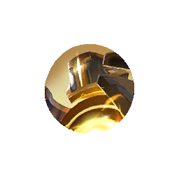
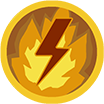
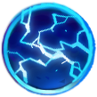
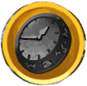

# Avalonian Construct

| Stage | Health | Mechanics |
| ----- | ------ | --------- |
| 1 | 100–90% | Devastating Smashes and movement-triggered Debris; Colossal Swipe becomes available after 12 seconds |
| 2 | 90–70% | Targeting, Energy Fields and Compensator Energy; remaining energy enables Energy Discharge |
| 3 | 70–30% | Avalonian Beam becomes available while Compensator Energy remains |
| 4 | 30–0% | Targeting grants ten energy charges instead of five; Avalonian Beam gains two follow-up shots while energy remains; melee attacks build momentum twice as quickly |
{: .nowrap-1 .nowrap-2 }

Independently of these health stages, **Adapted Fighting Protocol** begins after **45 seconds** and can gain another stack approximately every **45 seconds**.

## Construct’s abilities

- Devastating Smashes
- Debris
- Colossal Swipe
- Targeting
- Energy Field
- Compensator Energy
- Energy Discharge
- Avalonian Beam
- Energy Deficiency
- Adapted Fighting Protocol

### Devastating Smashes

The Construct’s melee attacks inflict additional physical damage within about **2.5 metres** of the target. Each attack also adds a permanent momentum stack, increasing **attack speed by 2.9%** and **physical auto-attack damage by 6% per stack**, up to **50 stacks**.

Moving triggers pulses that remove **three momentum stacks** at a time. At **30% health**, each melee attack begins adding **two stacks** instead of one.

### Debris

Movement also enables falling debris attacks against players. A targeted position receives a **4-metre-radius warning**, followed by an impact after about **1.7 seconds** that deals physical damage. Each selected player has a **4-second delay** before they can be selected for another debris placement.

### Colossal Swipe

After a **1.2-second cast**, the Construct sweeps a broad area extending roughly **9 metres** in front of itself. The swipe can travel from left to right or right to left. A hit deals physical damage, knocks players back approximately **12 metres** and applies a **3-second stun**.

This attack becomes available **12 seconds into the fight**.

### Targeting

At **90% health or below**, the Construct periodically begins a targeting sequence with a roughly **4-second detection window**. Moving players within about **35 metres** receive a target mark. The sequence fires at marked players within about **30 metres**, creating Energy Fields at their positions.

Each targeting sequence grants **five Compensator Energy charges**, increasing to **ten charges** at **30% health**. Each resulting Energy Field shot removes one charge. Targeting has a base cooldown of **35 seconds**.

### Energy Field

A targeting shot deals damage in a **4-metre-radius circle**. About **1.5 seconds after the impact area appears**, the lingering field becomes active, dealing damage every **0.5 seconds**. The lingering damage area remains active for roughly **44 seconds** unless the encounter ends or resets.

### Compensator Energy

These charges last **35 seconds**, with a maximum of **ten**. Each charge increases the Construct’s defence against players. Charges remaining after Targeting enable Energy Discharge and, from **70% health**, Avalonian Beam; both attacks become more powerful with additional energy.

Energy Field shots remove one charge each. The initial shot of an Avalonian Beam sequence also consumes one charge.

### Energy Discharge

While Compensator Energy remains, the Construct releases instant damage bursts against selected players, also hitting others within about **3 metres** of each target. Damage rises in steps at **two** and **five** remaining energy charges. This attack does not consume a charge.

### Avalonian Beam

From **70% health**, the Construct can spend a Compensator Energy charge to fire a straight beam after a **1.24-second cast**. Its damage area is approximately **3 metres wide and 36 metres long**. The beam deals physical damage, knocks players approximately **10 metres** away and applies a **3-second stun**. More remaining energy increases its damage.

At **30% health**, the first shot enables **two additional beam shots**. These follow-ups require energy to remain, but do not consume further charges. The Construct can select a new target for each shot.

### Energy Deficiency

If the Energy Field firing sequence exhausts the Construct’s Compensator Energy, it becomes **stunned for 6 seconds** and suffers reduced defence against players for the same duration.

This is triggered by the targeting-shot energy-removal effect. An energy charge spent on Avalonian Beam does not itself trigger Energy Deficiency.

### Adapted Fighting Protocol

Starting after **45 seconds of combat**, the Construct gains a permanent **10% damage bonus against players**. The effect can gain another stack approximately every **45 seconds**, reaching **five stacks**.
