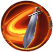
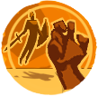

# Sir Bedivere

| Stage | Health | Mechanics |
| ----- | ------ | --------- |
| 1 | First health bar, 100–50% | Avalonian Cleave and Fate of the Unworthy; Earthbreaker unlocks at 85%, five-blade Bladestorm at 80% |
| Transition | First health bar reaches 50% | Shockwave, temporary invulnerability and a full heal |
| 2 | Second health bar, 100–0% | Longer Avalonian Cleave and Earthbreaker, Subjugate; Grasp of the Undying unlocks at 90%, nine-blade Bladestorm at 80%, Avalonian Bulwark at 75% |
{: .nowrap-1 .nowrap-2 }

In stage 1, Earthbreaker also unlocks after **30 seconds**, even if Bedivere remains above 85% health. Stage 2 thresholds refer to his **refilled health bar**. The 50% transition happens once.

## Sir Bedivere’s abilities

- Avalonian Cleave
- Fate of the Unworthy
- Earthbreaker
- Bladestorm
- Shockwave
- Grasp of the Undying
- Avalonian Bulwark → Avalonian Might
- Subjugate

### Avalonian Cleave

Bedivere's regular attack consists of **two physical cleaves** across a broad **120-degree frontal arc**. A small circle immediately around him is also included in each hit.

The first stage has a roughly **1.1-second wind-up**, followed by the second strike approximately **1.3 seconds later**. In stage 2, the first strike arrives after about **0.9 seconds** and the second about **1.4 seconds later**; the arc's radius increases from approximately **15 to 25 metres**. The arcs originate slightly behind Bedivere, so these are the attack-shape radii rather than exact distances from his centre.

He also reduces his current target's threat when that target is more than **7 metres** away, allowing him to change targets.

### Fate of the Unworthy

Bedivere maintains an aura extending roughly **20 metres**. Players inside gain a stacking damage-over-time effect, with another stack applied every **10 seconds**. The damage ticks every **2 seconds** after its initial tick and increases with the number of stacks.

The effect supports up to **50 stacks**. Once a player leaves the aura, a periodic check removes the accumulated effect within approximately **5 seconds**.

### Earthbreaker

A **1.56-second cast** strikes a narrow line toward a selected player, dealing physical damage and interrupting casting.

In stage 1, the line is about **3 metres wide and 16 metres long**, beginning slightly in front of Bedivere. In stage 2, it keeps the same width but extends to about **60 metres long**.

### Bladestorm

After approximately **1.6 seconds**, blades appear around a selected ground position. They rotate for roughly **4 seconds**, then fly outward in separate directions during the end of the **5-second sequence**. The central **3-metre-radius area** also deals repeated damage during the rotating portion.

There are **five blades in stage 1** and **nine in stage 2**. Each hit applies a stacking reduction to defence against mobs of **15% per charge**, lasting **5 seconds**. The later hits deal more damage and can add a short knockback and a **3-second stun**.

Bladestorm becomes available at **80% of the current stage's health bar**. The stage 2 version has a shorter cooldown. Target selection can favour a player more than **8 metres** away who is not highest on the threat list; this preference is probabilistic in tier 6 and unconditional when an eligible target is available in tiers 7–8.

### Shockwave

At **50% of his first health bar**, Bedivere begins his stage transition. After roughly **1.1 seconds of warning**, players within **10 metres** are knocked back about **15 metres** and stunned for **3 seconds**.

Bedivere becomes invulnerable for about **8.5 seconds** and maintains a **10-metre damaging aura**. The aura deals **6% of a victim's maximum health every 0.3 seconds**, ignoring armour, while the victim remains inside it.

The transition's **9.6-second healing cast** restores him to full health. He then enters stage 2 with the longer versions of Avalonian Cleave and Earthbreaker.

### Grasp of the Undying

After a **1.56-second cast**, Bedivere stuns a selected player for **8 seconds** and channels damage into them. The channel contains **nine hits, one second apart**, starting immediately. Each hit deals **20% of the victim's maximum health**, ignoring armour.

The normal selection excludes the highest-threat player and unlocks at **90% health in stage 2**. A separate stage 2 trigger can use the same ability on the current target when that target is more than **18 metres** away, regardless of the normal health unlock.

### Avalonian Bulwark / Avalonian Might

Available at **75% health in stage 2**. Bedivere casts for **1.6 seconds**, deals magic damage within **7 metres**, and knocks nearby players back about **15 metres**.

He then channels **Avalonian Bulwark**, increasing his defence against players. Three **80-degree sectors** extend roughly **30 metres** from him and rotate around the arena; their rotation direction alternates between uses.

During the channel, attacks made against Bedivere by players inside these sectors trigger **Avalonian Might**, a retaliatory projectile against the attacker. The retaliation is tied to the attacker's position in the rotating sectors.

### Subjugate

In stage 2, Bedivere can pull players within roughly **30 metres** toward him after a **0.56-second wind-up**. The pull finishes about **4 metres** from his centre. It also heavily reduces nearby players' threat, allowing the boss's attack target to change.
