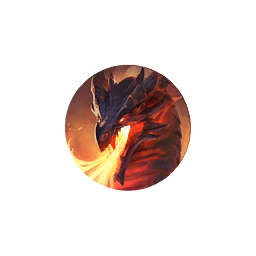
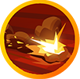
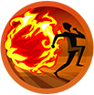
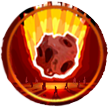
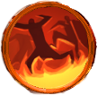
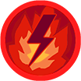

# Azaryon, the Fire Dragon

| Stage | Health  | Mechanics                                                                             |
| ----- | ------- | ------------------------------------------------------------------------------------- |
| 1     | 100–80% | Fire Breath, full Giant Rupture sequence, Inferno                                     |
| 2     | 80–60%  | Flames, single-stomp Giant Rupture, channeled Meteor                                  |
| 3     | 60–40%  | Fire Wall, Inferno, full Giant Rupture sequence                                       |
| 4     | 40–20%  | Opening meteor barrage, recurring targeted Meteors, channeled Meteor, Inferno         |
| 5     | 20–0%   | Transition explosions, Meltdown, recurring Meteors and a mixture of earlier mechanics |
{: .nowrap-1 .nowrap-2 }

## Azaryon’s abilities

- Claw Swipe
- Devastating Smash
- Fire Breath
- Swipe
- Tail Swipe
- Onslaught
- Giant Rupture (in → out → in movement)
- Inferno (hide behind the rock pillars)
- Meteor
- Fire Wall
- Oppressing Roar (at each stage transition)
- Meltdown (ultimate, stagger Fallen Staffs and Enigmatic Staffs)
- Enrage
- Flames → Fire Essence

### Claw Swipe

Azaryon swipes with his left or right claw after roughly **1.8 seconds**, hitting a broad area in front of him with physical damage.

The hit is substantially more dangerous when it catches only one player. Hitting at least two players reduces the damage per target, with a larger reduction for players wearing plate chest armour. This is not an equal damage split across everyone hit.

### Devastating Smash

A roughly **2-second** cast strikes a circle beside one of Azaryon’s front claws. A damaging hit also stuns the victim for **2 seconds** and applies a stacking vulnerability to mob damage that lasts **60 seconds**.

### Fire Breath

For the stationary variant, Azaryon winds up for roughly **1.9 seconds**, then sweeps fire across a front-side area for **3.3 seconds**. The breath hits every **0.2 seconds** while you remain in it, increasing the damage of subsequent hits.

The name **Fire Breath** also covers moving variants: Azaryon can charge while breathing fire, including a version in which he first turns around. These are separate from **Onslaught**.

### Swipe

Azaryon can turn toward players at his side with a fast, damaging sweep. The attacking turn has very little wind-up and does not provide the same conspicuous ground warning as his larger abilities.

### Tail Swipe

Players behind Azaryon can provoke a rear attack that deals physical damage and knocks victims a long distance away.

### Onslaught

Azaryon makes a short forward charge, damaging players along his path and around the impact, with knockback effects. He can choose this attack when his highest-threat target is too far in front of him.

### Giant Rupture

Three heavy stomps alternate their danger zones.

1. **Outer ring — 3.3-second wind-up.** Move into the clear centre.
2. **Inner circle — 2.3-second wind-up.** Move out beyond the marked circle.
3. **Outer ring — 2.7-second wind-up.** Move back into the clear centre.

Each wind-up is measured from that stomp’s cast start; recovery also separates the impacts.

The movement call is **in → out → in**. The zones are centred slightly in front of Azaryon, so judge the actual ground markings rather than simply standing beneath his body. The inner circle and outer ring overlap at their edges; one stationary “border” position will not safely cover the whole sequence. Hits cause heavy damage and knockback, and the final stomp also leaves fire behind.

**Single-stomp variant.** During summon mechanics, Azaryon uses the same ability name for a single nearby circular stomp with a **2.3-second wind-up**, followed by flame summons. **Move out** of that circle. Do not automatically step in just because the cast says Giant Rupture.

### Inferno

Azaryon prepares a massive fire attack with a **7-second wind-up**, followed by **20 rapid pulses, 0.22 seconds apart**—about **4.2 seconds from first pulse to last**. Rocks provide protection by blocking line of sight; stay behind one until the attack finishes. Repeated exposure becomes increasingly punishing, and Azaryon is invulnerable during the channel.

### Meteor

This name covers both a boss channel and the meteor hazards it produces. During the channel, Azaryon is protected while successive meteors fall. Later stages also produce recurring meteors alongside his other attacks.

Targeted meteors mark a circle with roughly **2 seconds’ warning** before impact, then split into **five smaller fireballs travelling outward**. Quick barrage meteors use a simpler impact without this follow-up, with the same roughly **2-second warning** per circle.

### Fire Wall

Azaryon marks players for a line of fire. The marker follows its target for **4.5 seconds**, then fixes the wall’s position. A further **1.5-second ground warning** gives players time to leave before activation—roughly **6 seconds after marking**. The wall can persist for about **60 seconds** unless an encounter cleanup removes it. The fire deals damage, adds burning damage over time and can fear players it damages.

### Oppressing Roar

Azaryon roars at each health-stage transition. Nearby players are slowed by **50% for about 4 seconds**, and briefly prevented from casting spells and attacking for **3 seconds**.

The transition at **20%** also sends delayed circular explosions outward in six radial lines.

### Meltdown

Meltdown has a 5-second warning followed by 17 damage pulses, one every 0.5 seconds. The last pulse occurs 8 seconds after the first pulse. The pulses become more punishing as the channel progresses. Azaryon is invulnerable during the sequence.

This is a major final-stage mechanic. The encounter also contains an anti-stalling path that can trigger Meltdown when excessive turning prevents normal attacks.

### Enrage

In the final two stages, prolonged fighting can enrage Azaryon: meteors become more frequent and his damage increases in further steps every **30 seconds**.

The normal timer in this client is **7 minutes within a stage**, enabled in the 40–20% and 20–0% stages and reset by a stage transition. It is not a seven-minute limit for the entire pull. The anti-stalling behaviour mentioned under Meltdown can also enable enrage through a separate route.

## Flames (hardened magma shells)

Flames (spikey balls) are summoned objects you remove with the Fire Essence mechanic. A marked player has **4 seconds before a Flame appears** at their position. Flames are protected from normal attacks and crowd control, so assigning ordinary damage dealers to burn them down will not solve the mechanic.

The recommended collector sequence is: **take three Fire Essence pickups → approach the Flame → use Unstable Fire Essence**.

### Fiery Pulse

Each Flame summon damages nearby players within roughly **5 metres** every **2.5 seconds**.

### Fire Essence

Flames launch Fire Essence pickups onto the ground. A pickup can be consumed by one player and remains available for about **8 seconds**. Taking it causes a hit of magic damage and grants **Consumed Fire Essence**.

### Consumed Fire Essence

This is the stacking effect gained from collecting essence. Reaching **three stacks** consumes the stacks and grants temporary access to **Unstable Fire Essence**.

### Unstable Fire Essence

After the third pickup, the temporary ability **Unstable Fire Essence** replaces your **first weapon ability** for **8 seconds**. During this window, your other ability slots are blocked, your movement speed increases, and you are immune to the summons’ Fiery Pulse.

Activating the temporary ability removes flame summons within roughly **11 metres**. More than one summon can be caught in the area.

### Primordial Fire Pulse

If a pickup is left uncollected, it releases an expanding pulse that can sweep across the raid, dealing armour-ignoring damage.
