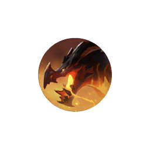
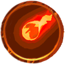

# Fire Drake

The Dragon Sanctuary Fire Drake has **one continuous stage**. Its attacks unlock through elapsed time, health thresholds and target distance, rather than through separate health phases.

| Ability     | Available                                                                                                                       |
| ----------- | ------------------------------------------------------------------------------------------------------------------------------- |
| Claw Swipe  | **1.5 seconds** into the fight.                                                                                                 |
| Bite        | **3 seconds**, when the current target is at least **6 metres** away.                                                           |
| Onslaught   | **8 seconds**, against a target at least **11 metres** away.                                                                    |
| Fire Breath | **10 seconds or 65% health**, whichever comes first.                                                                            |
| Lava        | **12 seconds or 80% health**, whichever comes first.                                                                            |
| Wing Strike | **15 seconds or 80% health**, whichever comes first. Before **7 seconds**, the current target must also be within **7 metres**. |
{: .nowrap-1 }

These are availability conditions, not a fixed cast order. Another action, a cooldown or the absence of a suitable target can delay an attack.

## Fire Drake’s abilities

- Claw Swipe
- Bite
- Wing Strike
- Onslaught
- Fire Breath
- Lava

### Claw Swipe

The Fire Drake swipes with its left or right claw after roughly **1.1 seconds**, sweeping an area in front of it. It aims at its current target, but the sweep can hit other players in its path. The attack has no visible ground warning.

A damaging hit applies **Bleed**, which can stack up to **five times**. Each application schedules **eight physical-damage ticks**, starting immediately and repeating every **2 seconds**. The last scheduled tick is **14 seconds after application**; further swipes can add to the bleed.

### Bite

The Fire Drake bites forward after roughly **1.2 seconds**, hitting a rectangular area in front of its head without a visible ground warning. It chooses this attack when its current target is at least **6 metres** away and within the ability’s casting range.

The hit ignores armour. A damaging hit **prevents healing for 2 seconds** and can pull a more distant victim toward the Drake shortly afterwards. This effect blocks healing completely during its duration; it is not merely reduced healing received.

### Wing Strike

A roughly **1.1-second cast** marks a broad cone in front of the Fire Drake, aimed toward its current target. The wing gust knocks players back, with a base knockback distance of **8 metres**.

A narrower area close to the front overlaps the broad cone. Players caught there also receive a physical-damage hit and a stronger knockback effect with a base distance of **12 metres**.

### Onslaught

The Fire Drake selects a player at least **11 metres** away and prepares a charge for roughly **1.3 seconds**. It displays a ground warning, while the usual cast bar is hidden. The selected player can be someone other than its current target.

The moving Drake knocks nearby players aside. Players successfully knocked back by this part of the attack take physical damage and are **stunned for 1.5 seconds**. The movement effect pushes players wearing plate chest armour **3 metres**, and other players **6 metres**.

After the charge ends, a separate circular impact becomes dangerous roughly **0.5 seconds later**, in an area about **4.5 metres in radius** ahead of the Drake. This impact deals physical damage and also **stuns for 1.5 seconds**. The charge and finishing impact are separate hazards.

### Fire Breath

The Fire Drake prepares for **1.8 seconds**, then sweeps fire to one side over a roughly **2-second attack window**. Left- and right-sweeping variants use the same ability name. A visible ground warning accompanies the cast.

The breath repeatedly hits players within the moving fire area, at **0.2-second intervals**. Successive hits increase in damage, making prolonged exposure increasingly punishing.

Target selection favours players other than the highest-threat target, although that target remains eligible. The Drake can therefore turn its breath toward the party even while the tank retains its attention for other attacks.

### Lava

The Fire Drake targets a player other than its highest-threat target and marks a **3-metre-radius circle** at that player’s position. A **0.9-second cast**, followed by a short delay, launches the lava attack.

The initial impact deals magic damage. A lava pool then remains for **30 seconds**, dealing further magic damage every **0.5 seconds** to players inside. Leaving the pool stops its ongoing damage. The impact and pool can affect other players as well as the selected target.
