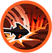
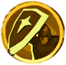
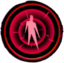

# Avalonian Knight Commander

| Stage | Health | Mechanics |
| ----- | ------ | --------- |
| 1 | 100–85% | Fate of the Impure, Fateful Swings and Two-Handed Swing |
| 2 | 85–50% | Avalonian Barrier is added |
| 3 | 50–40% | Leap of Faith replaces Two-Handed Swing; Avalonian Barrier continues |
| 4 | 40–0% | Avalonian Oath and Trial of the Impure are added |
{: .nowrap-1 .nowrap-2 }

Two-Handed Swing becomes available **8 seconds into combat**. The voice cue at **55% health** precedes the actual attack change at **50%**. Fate of the Impure and Fateful Swings remain active throughout the fight.

## Knight Commander’s abilities

- Fate of the Impure
- Fateful Swings
- Divine Spark
- Two-Handed Swing
- Avalonian Barrier
- Leap of Faith
- Avalonian Oath
- Trial of the Impure

### Fate of the Impure

A persistent aura damages enemies in the Captain’s visible presence within roughly **30 metres**. The first tick occurs about **1 second** after the aura reaches a player, then every **2 seconds**. This damage ignores armour.

### Fateful Swings

The Captain’s normal attacks trigger an additional damaging hit against a target without **Divine Spark**. Divine Spark prevents this additional hit; it does not remove the Captain’s normal attack or his other abilities.

### Divine Spark

The encounter’s shrine effect grants **60 seconds** of protection from Fateful Swings and increases the recipient’s generated threat by **300%**.

### Two-Handed Swing

After a **1.5-second cast**, the Captain strikes two adjacent **45-degree sectors** in front of him, with the second sector activating about **2 seconds after the first**. Each wave extends outward to approximately **29 metres**, leaving an inner gap of roughly **2 metres**.

A hit deals damage, knocks the player back about **15 metres**, and applies a **3-second stun**. The ability has a **20-second base cooldown** and stops being selected at **50% health**. In Tier VII and VIII dungeons, the Captain also requires his current target to be within **11 metres** before starting the cast.

### Avalonian Barrier

Available from **85% health**. A **2-second cast** produces a burst within **10 metres**, dealing magic damage and knocking players back roughly **15 metres**.

The Captain then channels a barrier for about **4 seconds**, reducing damage received from players. A **170-degree frontal sector**, extending from about **1 to 40 metres**, marks the area where attackers can trigger **Avalonian Might**: damaging the Captain from within this sector causes a retaliatory projectile against the attacker. The retaliation is limited by a short **0.3-second** effect on each affected attacker. Avalonian Barrier has a **25-second base cooldown**.

### Leap of Faith

Available from **50% health**. The Captain marks a player’s position with a **10-metre-radius circle**, casts for **1.5 seconds**, and leaps toward it.

The landing has two effects. Players within the central **3 metres** take the heavier hit and a **4-second stun**. Players outside that centre but within **10 metres** take a lighter hit, a knockback of roughly **20 metres**, and a **2-second stun**. The centre grants immunity to the outer hit, so those two impacts do not both apply to the same player. The ability has a **12-second base cooldown**.

### Avalonian Oath

Available from **40% health**. Each Oath grants a lasting stack of **5% movement speed** and **10% bonus damage against players**. The Captain channels for about **6 seconds**, repeatedly marking players in his sight within **40 metres** for the following Trial of the Impure.

Oath has a **30-second base cooldown**. Its stat increases stack, so later Oaths strengthen the Captain further.

### Trial of the Impure

Avalonian Oath prepares this follow-up attack. The Captain releases a burst over a **40-metre radius**. It damages players carrying Oath’s **“In sight”** mark and removes that mark. The damage cannot be reflected.
